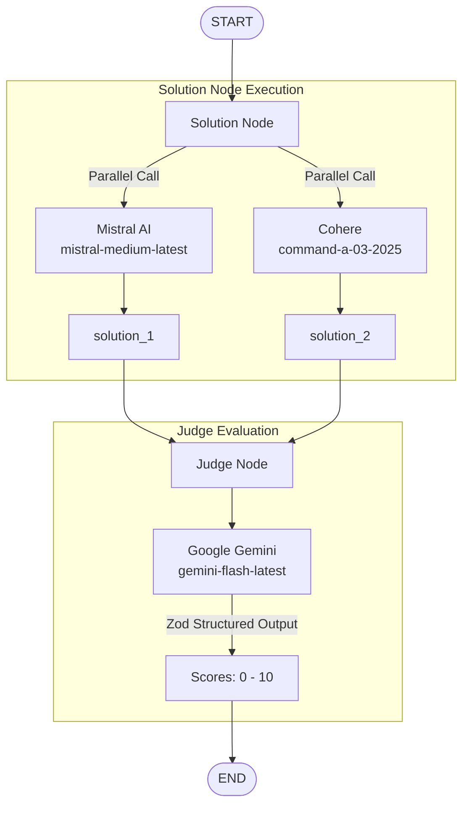

# ⚔️ LangGraph Battle AI Arena

An automated multi-model LLM benchmarking and evaluation arena built with **LangGraph**, **LangChain**, **TypeScript**, and **Express.js**. 

The system runs competing AI models in parallel to generate solutions for a given prompt, then passes the results to an independent LLM judge node which evaluates and scores each solution using structured outputs.

---

## 🚀 Features

- **Multi-Model Battle Arena**: Parallel invocation of diverse LLM providers (Mistral AI & Cohere) to generate candidate solutions.
- **Automated AI Judge**: Uses Google Gemini as an impartial evaluator to rate solutions on a 0–10 score range.
- **LangGraph State Management**: Robust node-based workflow graph using `@langchain/langgraph` with typed state schema and custom reducers.
- **Structured Output Evaluation**: Uses Zod validation to ensure deterministic scoring outputs from the judge model.
- **Express.js API Backend**: Modular TypeScript REST API server powered by `tsx` for high performance and hot-reloading development.

---

## 🏗 Architecture & Graph Workflow

The LangGraph workflow consists of a state graph with two main execution nodes:



### Execution Flow:
1. **State Initialization**: The graph receives the user's input prompt.
2. **Solution Node (`solutionNode`)**: Concurrently invokes `mistral-medium-latest` and `command-a-03-2025` via `Promise.all()`.
3. **Judge Node (`judgeNode`)**: Receives both generated solutions, constructs an evaluation context, and uses `gemini-flash-latest` with a structured Zod schema to produce comparative scores (`solution_1_score`, `solution_2_score`).

---

## 🛠 Tech Stack

- **Runtime & Language**: [Node.js](https://nodejs.org/), [TypeScript](https://www.typescriptlang.org/) (ES Modules)
- **Framework**: [Express 5](https://expressjs.com/)
- **Orchestration**: [@langchain/langgraph](https://www.npmjs.com/package/@langchain/langgraph), [@langchain/core](https://www.npmjs.com/package/@langchain/core)
- **AI Integrations**:
  - Google Gemini (`@langchain/google`)
  - Mistral AI (`@langchain/mistralai`)
  - Cohere (`@langchain/cohere`)
- **Schema Validation**: [Zod](https://zod.dev/)
- **Dev Tooling**: `tsx` (TypeScript Execute & Watch)

---

## 📦 Project Structure

```
├── server.ts                 # Express server entry point (Port 3000)
├── src
│   ├── app.ts                # Express app setup and REST routes
│   ├── config
│   │   └── config.ts         # Environment variable config & type definitions
│   └── services
│       ├── models.service.ts # Instantiated LangChain model providers
│       └── graph.ai.service.ts# LangGraph state schema, nodes, and graph compiler
├── .env                      # API keys and secret configuration
├── tsconfig.json             # TypeScript compiler configuration
└── package.json              # Dependencies and npm scripts
```

---

## ⚙️ Getting Started

### Prerequisites

- Node.js `v18+` or `v20+`
- API Keys for:
  - [Google AI Studio](https://aistudio.google.com/) (Gemini)
  - [Mistral AI Platform](https://console.mistral.ai/)
  - [Cohere Dashboard](https://dashboard.cohere.com/)

### 1. Installation

Clone the repository and install dependencies:

```bash
git clone https://github.com/your-username/Langgraph-battle-ai-arena.git
cd Langgraph-battle-ai-arena
npm install
```

### 2. Environment Setup

Create a `.env` file in the root directory:

```env
GOOGLE_API_KEY=your_google_gemini_api_key
MISTRAL_API_KEY=your_mistral_api_key
COHERE_API_KEY=your_cohere_api_key
```

### 3. Run Development Server

Start the application with live reload:

```bash
npm run dev
```

The server will start on `http://localhost:3000`.

---

## 🔌 API Endpoints

### 1. Health Check
- **URL**: `/health`
- **Method**: `GET`
- **Response**:
  ```json
  {
    "status": "ok"
  }
  ```

### 2. Run Battle Graph
- **URL**: `/use-graph`
- **Method**: `POST`
- **Description**: Triggers the LangGraph workflow to compare responses and evaluate scores.

---

## 📜 License

This project is licensed under the [ISC License](LICENSE).
